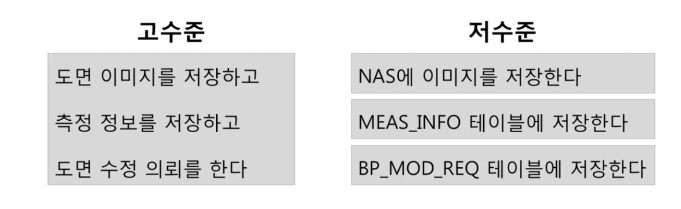

# 고수준 모듈, 저수준 모듈
### 고수준 모듈
의미 있는 단일 기능을 제공한다
상위 수준의 정책을 구현한다

### 저수준 모듈
고수준 모듈의 기능을 구현하기 위해 필요한 하위 기능의 실제 구현이다.

## 고수준 모듈, 저수준 모듈 예시
EX) 수정한 도면 이미지를 NAS에 저장하고 측정 정보를 DB테이블에 저장하고 수정 의뢰 정보를 DB에 저장하는 기능


## 고수준이 저수준에 직접 의존하면??
저수준 모듈을 변경하면 고수준 모듈에 영향이 생길 수 있따.

```JAVA
public class MeasureService {
	
	public void mesasure(MeasureReq req) {
		File file = req.getFile();
		nasStorage.save(file);
		
		jdbcTemplate.update("insert into MEAS_INFO");
		
		jdbcTemplate.update("insert into BP_MOD_REQ");
	}
		

}
```
```JAVA

public class MeasureService {
	
	public void mesasure(MeasureReq req) {
		File file = req.getFile();
		s3Storage.upload(file);
		
		jdbcTemplate.update("insert into MEAS_INFO");
		
		rabitmq.convertAndSend();
	}
		

}

```
고수준 정책은 바뀌지 않았지만 저수준 구현 병경으로 코드 변경이 발생하였다.

## Dependency Inversion Principle(의존 역전 원칙)
고수준 모듈은 저수준 모듈의 구현에 의존하면 안된다
저수준 모듈이 고수준 모듈에서 정의한 추상타입에 의존해야 한다.

## 고수준 관점에서 추상화
고수준 입장에서 저수준 모듈을 추상화 해야한다
(구현 입장에서 추상화하면 안됨)

### DIP의 장점
고수준 모듈의 변경을 최소화하면서, 저수준 모듈의 변경 유연함을 높일 수 있다.

### 추상화 노력이 필요하다
처음부터 바로 좋은 설계가 나올 수는 없다.
요구사항/업부 이해가 높아지면서 저수준 모듈을 인지하고 상위 수준 관점에서 저수준 모듈에 대한 추상화를 시도해야 한다.

## 예시
### 상품 상세 정보와 추천 상품 목록 제공하는 기능
상품번호를 이용하여 상품 DB에서 상세 정보를 구함.
Daara API를 이용하여 추천 상품 5개를 구한다.
추천 상품이 5개 미만이면 같은 분류에 속한 상품 중 최근 한 달 판매가 많은 상품을 ERP에서 구해서 5개를 채운다.

### 고수준
상품 번호로 상품 상세정보를 구한다
추천 상품 5개를 구한다
인기상품을 구한다

### 저수준
DB에서 상세정보 구함
Daara API에서 상품 5개를 구한다
같은 분류에 속한 상품에서 최근 한 달 판매가 많은 상품을 ERP에서 구한다.


