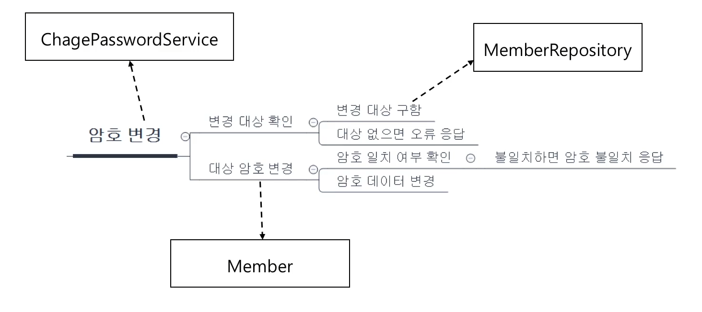

# 기능과 책임분리
## 기능 분해
기능은 하위 기능으로 분해된다.

### 기능을 누가 제공할 것인가?
기능은 곧 책임이다.
분리한 기능을 객체에 알맞게 분배해주어야 한다

```JAVA
public class changepassword {
	public Result changePassword(
			String id, String oldPw, String newPw) {
		Member mem= memberRepository.findOne(id);
		if(mem==null) {
			return Result.NO_MEMBER;
		}
	}
	try {
		mem.changePassword(oldPw,NewPw)
		return Result.SUCCESS;
	} catch(BadPasswordException ex) {
		return Result.BAD_PASSWORD
	}


}
```
## 큰 클래스, 큰 메서드
### 클래스나 메서드가 커지면 절차지향의 문제가 발생한다
-큰 클래스 : 많은 필드를 많은 메서드가 공유
- 큰 메서드 : 많은 변수를 많은 고드가 공유
- 여러 기능이 한 클래스/메서드에 섞여있을 가능성이 크다
### 책임에 따라 알맞게 코드분리가 필요하다!
# 책임 분배/분리 방법
## 1. 패턴적용
### 간단한 웹
컨트롤러, 서비스, DAO
### 복잡한 도메인
엔티티, 밸류, 리포지토리, 도메인 서비스
### AOP
Aspect(공통기능)
### GOP
팩토리, 빌더, 전략, 템플릿 메서드, 프록시/데코레이터 등

## 2. 계산분리
## 3. 연동분리
네트워크, 메시징, 파일 등 연동 처리코드 분리
## 4. 조건분기는 추상화
연속적인 if-else는 추상화
### 의도가 잘 드러나는 이름을 사용해야 한다
ex)HTTP로 추천 데이터 읽어오는 기능 : RecommendService가 HttpDataService 보다 좋다.
## 역할 분리와 테스트
역할 분리가 잘 되면 테스트도 용이해진다.
