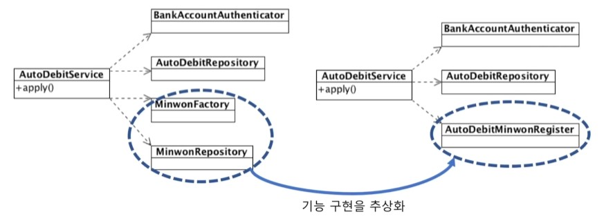

# 의존
기능 구현을 위해 다른 구성 요소를 사용하는것
ex) 객체 생성, 메서드 호출, 데이터 사용

## 의존은 변경이 전파될 가능성을 의미한다
의존하는 대상이 바뀌면 바뀔 가능성이 높아짐
ex)호출하는 메서드의 파라미터가 변경
   호출하는 메서드가 발행할 수 있는 익셉션 타입이 증가
## 순환의존
변경이 연쇄 전파될 가능성이 있다
클래스, 패키지, 모듈 등 모든 수준에서 순환의존이 없도록 해야한다

## 의존하는 대상이 많다면?

의존하는 대상이 많다면 내가 바뀔 가능성이 많다  => 의존하는 대상이 적을수록 좋다!

# 의존하는 대상이 많을 때
## 1. 기능이 많은 경우
한 클래스에서 많은 기능을 제공하는 경우
각 기능마다 의존하는 대상이 다를 수 있고, 한 기능의 변경이 다른 기능에 영향을 줄 수 있다.
해결방안 1: 기능 별로 분리한다
```JAVA
public class UserService {
	public void regist() {
		
	}
	public void changePW() {
			
		}
	public void blockUser() {
		
	}
	...
	
}
```
```JAVA
public class UserRegistService {
	public void regist() {
		
	}
}

public class changePWService {
	public void changePW() {
		
	}
}

public class blockUserService {
	public void blockUser() {
		
	}
}
```
해결방안 2: 몇 가지 의존 대상을 단일 기능으로 묶어서 생각해보면 의존 대상을 줄일 수 있음


## 의존 대상 객체를 직접 생성하면??

생성클래스가 바뀌면 의존하는 코드도 바뀐다

### 의존대상 객체를 직접 생성하지 않는 방법
1. 팩토리, 빌더
2. 의존 주입(Dependency Injection)
3. 서비스 로케이터(Service Locator)

## 의존 주입(Dependency Injection)
외부에서 의존 객체를 주입
생성자나 메서드를 이용하여 주입한다.
```JAVA
public class ScheduleService {
	private UserReposiotry repository;
	private Calculator cal;
	
	public ScheduleService(UserRegistService repositoryRegistService repository) {
		this.repository = repository;
	
	}
	
	PublicKey voidKey setCalculator(Calculator Cal) {
		this.cal = cal;
	}
}
// 초기화 코드
UserRepository userRepo = new DbUserRepository();
Calculator cal = new Calculator();

ScheduleService schSvcScheduleService = new ScheduleService(userRepo);
schSvc.setCalculator(cal);
```
